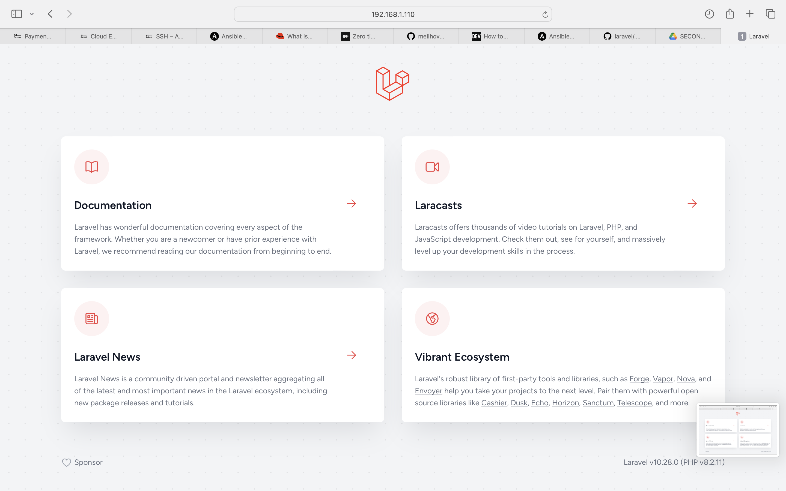
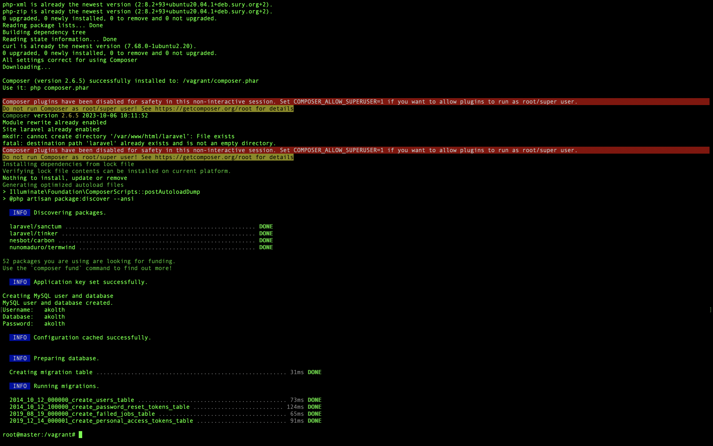
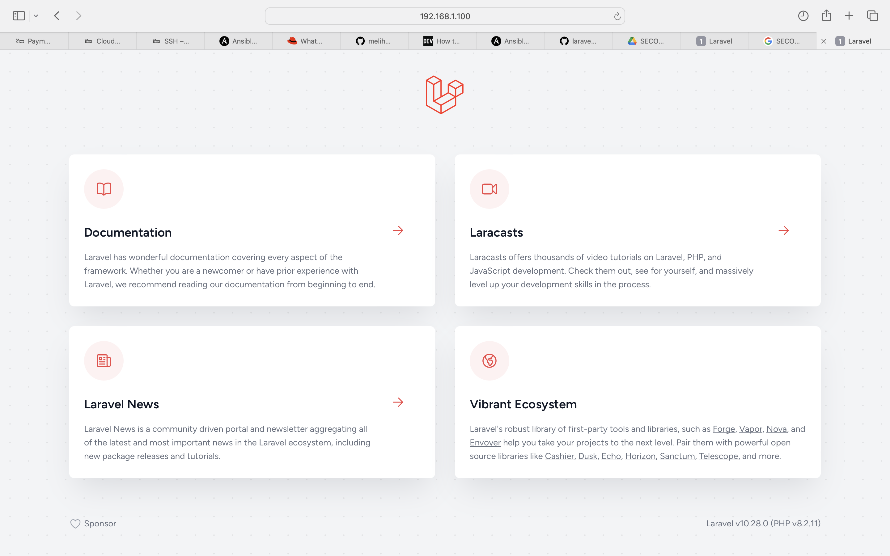

#**LARAVEL Deployment on SLAVE Machine from a Master machine Using Ansible**

The objective of this project is to Automate the provisioning of two Ubuntu-based servers, named “Master” and “Slave”, using Vagrant. Then to create a bash script to automate the deployment of a LAMP (Linux, Apache, MySQL, PHP) stack on the Master Machine. The script is also intended to clone a PHP application from GitHub, install all necessary packages, and configure Apache web server and MySQL.
Then using an Ansible Playbook, i'm to execute the bash script on the Slave node and verify that the PHP application is accessible through the VM’s IP address, also to create a cron job to check the server’s uptime every 12 am.

**THIS PROJECT HAS THE FOLLOWING REQUIREMENTS**

- Virtual machine running ubuntu servers
- Apache2 
- Php
- MySQL Database 
- Laravel Application and dependencies
- Ansible Playbook


**SETUP**

LAMP setup on both master and slave stack comprising of the following applications

Linux - The operating system hosting the applications
Apache - The free and open-source cross-platform web server software to be installed on the servers.
MySQL/MariaDB – open source relational database management system.
PHP – The programming/scripting language used for the development of  web applications.
Laravel application cloning from github repo

**PREREQUISITES**

- VAGRANT
- VIRTUAL BOX
- COMMAND LINE/TERMINAL
- ANSIBLE PLAYBOOK

**DEEP DIVE**

My mchines.sh script was configured to create two servers namely the "Master" and "Slave". Memory assigned to each of the machines was 1024mb and 2 CPUS were assigned to each.
This will contain a deep dive into the setup of each of the servers.

**MASTER MACHINE OVERVIEW**

A Master Machine was generated with the designation "Master" using the "ubuntu/focal64" image , the machine is being hosted on a private network and being assigned with a public static IP address of "192.168.1.110"


**MASTER MACHINE CONFIGURATION**

- An update and upgrade was first run on the server using the apt-update and apt-upgrade commands to update packages on the master machine

```bash
sudo apt-get update && sudo apt-get upgrade -y
```

- Then apache 2 was installed on this server 
```bash
sudo apt install apache2 -y 
```

- Mysql was then installed on this server
```bash
sudo apt-get install mysql-server -y
```

- Then a ondrej personal package archive was added using the apt-add-repository command
```bash
sudo add-apt-repository -y ppa:ondrej/php
```

- PHP and it's dependencies was installed by running
```bash
sudo apt-get install libapache2-mod-php php php-common php-xml php-mysql php-gd php-mbstring php-tokenizer php-json php-bcmath php-curl php-zip unzip -y < /dev/null
```

- To deploy the laravel application on the master, we have to first install composer 
curl is first installed, then composer installer script is download with curl and piped to the php intepreter for execution. Then "composer --version" is run to confirm installation 
```bash
sudo apt install curl -y 

sudo curl -sS https://getcomposer.org/installer | php 

sudo mv composer.phar /usr/local/bin/composer 

composer --version < /dev/null
```

- Then Apache was configured to allow user IP and to enable laravel.conf. Apache was also restarted to enable configuration. Commands ran to activate the Apache rewrite module and Laravel virtual host configuration

```bash
cat << EOF > /etc/apache2/sites-available/laravel.conf
<VirtualHost *:80>
    ServerAdmin admin@example.com
    ServerName 192.168.1.110
    DocumentRoot /var/www/html/laravel/public

    <Directory /var/www/html/laravel>
    Options Indexes MultiViews FollowSymLinks
    AllowOverride All
    Require all granted
    </Directory>

    ErrorLog ${APACHE_LOG_DIR}/error.log
    CustomLog ${APACHE_LOG_DIR}/access.log combined
</VirtualHost>
EOF

sudo a2enmod rewrite 

sudo a2ensite laravel.conf

sudo systemctl restart apache2
```

- Cloning of Laravel application and dependecies 
Script also enables the copy the file from .env.example to .env and generate an encryption key, 
```bash
mkdir /var/www/html/laravel && cd /var/www/html/laravel

cd /var/www/html && sudo git clone https://github.com/laravel/laravel.git

cd /var/www/html/laravel && composer install --no-dev < /dev/null

sudo chown -R www-data:www-data /var/www/html/laravel

sudo chmod -R 775 /var/www/html/laravel

sudo chmod -R 775 /var/www/html/laravel/storage

sudo chmod -R 775 /var/www/html/laravel/bootstrap/cache

cd /var/www/html/laravel && sudo cp .env.example .env

php artisan key:generate
```

- Mysql is then configured, user and password was created and it was configured to take in user and password as arguments which will be included when trying to run the script
```bash
echo "Creating MySQL user and database"
PASS=$2
if [ -z "$2" ]; then
  PASS=`openssl rand -base64 8`
fi

mysql -u root <<MYSQL_SCRIPT
CREATE DATABASE $1;
CREATE USER '$1'@'localhost' IDENTIFIED BY '$PASS';
GRANT ALL PRIVILEGES ON $1.* TO '$1'@'localhost';
FLUSH PRIVILEGES;
MYSQL_SCRIPT

echo "MySQL user and database created."
echo "Username:   $1"
echo "Database:   $1"
echo "Password:   $PASS"
```


- Then we execute key generate and migrate command for php
```bash
php artisan config:cache
cd /var/www/html/laravel && php artisan migrate
```

- Lastly Ansible is installed on the Master Machine 
```bash
sudo apt install ansible -y </dev/null
```

- This is an image of laravel running on the Master machine



**Ansible Script Deep dive**

The ansible directory is composed of:
- Inventory: This contains the IP of the target machine which in our case is the slave machine created earlier, IP [192.168.1.100]
- ansible.cfg: configuration file used to define parameters, which specified the targeted inventory, the privatekey file and disabling of host key checkin
- site.yaml: Contains the tasks to be run on the slave machine.


**ANSIBLE SCRIPT BREAKDOWN**

- All hosts were targeted and ansible was configured to run as a superuser 
```yaml
- hosts: all
  become: yes
```

- The first task was to updade and upgrade the server using the "apt" module 
```yaml
- name: update & upgrade server
    apt: 
      update_cache: yes
      upgrade: yes
```
- A cron tab task was set to check the uptime of the server at every 12am, and to publish logs into a logfile passing both standard output and standard error into the log file.
```yaml
name: setting a cron job to check the uptime of the server every 12am
    cron:
      name: setting cron job to check uptime of the server every 12am
      minute: "0"
      hour: "0"
      day: "*"
      month: "*"
      weekday: "*"
      job: "/usr/bin/uptime > /var/log/uptime_check.log 2>&1"
      state: present
``` 

- Next task is to copy the bash script named "laravel-slave.sh" using the "copy" module from into slave machine from where it'll be run automatically by ansible
```yaml
- name: copying bash script into the slave machine
    copy:
      src: laravel-slave.sh
      dest: ~/
      owner: root
      group: root
      mode: 0744
```

- Then execute permissions are set for the script using the "command"module 
```yaml
- name: Setting Execute Permissions on the Script
    command: chmod +x ~/laravel-slave.sh
```

- Then a task to run the bash script while also passing the username and password as arguments fo the database 
```yaml
- name: Run Bash Script
    command: bash laravel-slave.sh akolth akolth < /dev/null 
```



**Breakdown of the Bash script run by ansible on the slave machine to install LAMP stack and also run laravel**
A script named "laravel-slave.sh" was created which ansible copies to and runs on the slave machine 

- A server update and upgrade was run using the apt-update and apt-upgrade commands 

```bash
sudo apt-get update && sudo apt-get upgrade -y
```

- Then apache 2 was installed on this server 
```bash
sudo apt install apache2 -y 
```

- Mysql was then installed on this server
```bash
sudo apt-get install mysql-server -y
```

- Then a ondrej personal package archive was added using the apt-add-repository command
```bash
sudo add-apt-repository -y ppa:ondrej/php
```

- PHP and it's dependencies was installed by running
```bash
sudo apt-get install libapache2-mod-php php php-common php-xml php-mysql php-gd php-mbstring php-tokenizer php-json php-bcmath php-curl php-zip unzip -y < /dev/null
```

- To deploy the laravel application on the slave machine, composer has to be installed first
curl is first installed, then composer installer script is download with curl and piped to the php intepreter for execution. Then "composer --version" is run to confirm installation 
```bash
sudo apt install curl -y 

sudo curl -sS https://getcomposer.org/installer | php 

sudo mv composer.phar /usr/local/bin/composer 

composer --version < /dev/null
```

- Then Apache was configured to allow user IP and to enable laravel.conf. Apache was also restarted to enable configuration. Commands ran to activate the Apache rewrite module and Laravel virtual host configuration

```bash
cat << EOF > /etc/apache2/sites-available/laravel.conf
<VirtualHost *:80>
    ServerAdmin admin@example.com
    ServerName 192.168.1.100
    DocumentRoot /var/www/html/laravel/public

    <Directory /var/www/html/laravel>
    Options Indexes MultiViews FollowSymLinks
    AllowOverride All
    Require all granted
    </Directory>

    ErrorLog ${APACHE_LOG_DIR}/error.log
    CustomLog ${APACHE_LOG_DIR}/access.log combined
</VirtualHost>
EOF

sudo a2enmod rewrite 

sudo a2ensite laravel.conf

sudo systemctl restart apache2
```

- Cloning of Laravel application and dependecies 
Script also enables the copy the file from .env.example to .env and generate an encryption key, 
```bash
mkdir /var/www/html/laravel && cd /var/www/html/laravel

cd /var/www/html && sudo git clone https://github.com/laravel/laravel.git

cd /var/www/html/laravel && composer install --no-dev < /dev/null

sudo chown -R www-data:www-data /var/www/html/laravel

sudo chmod -R 775 /var/www/html/laravel

sudo chmod -R 775 /var/www/html/laravel/storage

sudo chmod -R 775 /var/www/html/laravel/bootstrap/cache

cd /var/www/html/laravel && sudo cp .env.example .env

php artisan key:generate
```

- Mysql is then configured, user and password was created and it was configured to take in user and password as arguments which was configured in the ansible playbook
```bash
echo "Creating MySQL user and database"
PASS=$2
if [ -z "$2" ]; then
  PASS=`openssl rand -base64 8`
fi

mysql -u root <<MYSQL_SCRIPT
CREATE DATABASE $1;
CREATE USER '$1'@'localhost' IDENTIFIED BY '$PASS';
GRANT ALL PRIVILEGES ON $1.* TO '$1'@'localhost';
FLUSH PRIVILEGES;
MYSQL_SCRIPT

echo "MySQL user and database created."
echo "Username:   $1"
echo "Database:   $1"
echo "Password:   $PASS"
```


- Then we execute key generate and migrate command for php
```bash
php artisan config:cache
cd /var/www/html/laravel && php artisan migrate
```

- Lastly Ansible is installed on the Master Machine 
```bash
sudo apt install ansible -y </dev/null
```

- This is an image of laravel running on the Master machine which can be accessed via the IP address of the slave machine



